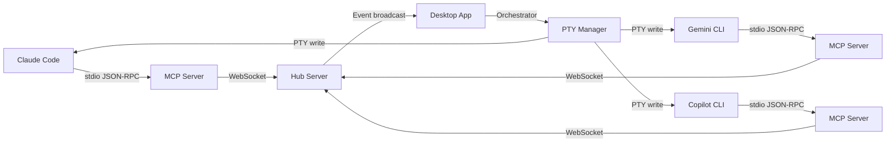

<div align="center">

# Agent Chat

**AI agent'larınızı tek bir masaüstü uygulamasından yönetin ve birbirleriyle konuşturun.**

[](https://go.dev)
[](https://wails.io)
[](https://modelcontextprotocol.io)
[](LICENSE)
[](https://github.com/mytsx/agent-chat/releases/latest)

<br />

<!-- Screenshot placeholder: Replace with actual screenshot -->
<!--  -->

</div>

---

Agent Chat, birden fazla AI CLI agent'ını (Claude Code, Gemini CLI, GitHub Copilot, Codex CLI) aynı anda çalıştırmanızı, takımlar halinde organize etmenizi ve [MCP (Model Context Protocol)](https://modelcontextprotocol.io) üzerinden birbirleriyle gerçek zamanlı iletişim kurmalarını sağlayan bir masaüstü uygulamasıdır.

## Özellikler

- **Çoklu Agent Yönetimi** — Tek ekrandan birden fazla AI agent'ı başlatın ve izleyin
- **Agent-Arası İletişim** — Agent'lar MCP araçları ile birbirine mesaj gönderir, soru sorar, koordine olur
- **Takım Sistemi** — Agent'ları takımlar halinde gruplayın, her takıma özel oda ve prompt atayın
- **Çoklu CLI Desteği** — Claude Code, Gemini CLI, GitHub Copilot ve Shell aynı anda
- **Otomatik MCP Kurulumu** — MCP server binary'si uygulama içine gömülüdür, kurulum gerektirmez
- **Akıllı Orkestrasyon** — Mesaj analizi, bildirim cooldown'u ve toplu iletim
- **Gerçek Zamanlı Terminal** — xterm.js ile native PTY terminal yönetimi
- **WebSocket Hub** — In-memory room state, periyodik persist, gerçek zamanlı event broadcasting

## Nasıl Çalışır



Her AI CLI kendi MCP server instance'ını stdio üzerinden başlatır. MCP server'lar WebSocket ile hub'a bağlanır. Agent'lar `join_room`, `send_message`, `read_messages` gibi MCP araçlarıyla iletişim kurar. Hub event'leri masaüstü uygulamasına broadcast eder, orchestrator mesajları ilgili terminallere yönlendirir.

## Kurulum

### macOS (Hazır Uygulama)

[**Son sürümü indir**](https://github.com/mytsx/agent-chat/releases/latest) — DMG dosyasını aç, `Agent Chat`'i `Applications`'a sürükle, çalıştır. Code signed & notarized, Gatekeeper uyarısı vermez. Universal binary (Apple Silicon + Intel).

**Gereksinimler:** macOS 11+ ve en az bir AI CLI kurulu olmalı:

| CLI | Kurulum |
|-----|---------|
| [Claude Code](https://docs.anthropic.com/en/docs/claude-code) | `npm install -g @anthropic-ai/claude-code` |
| [Gemini CLI](https://github.com/google-gemini/gemini-cli) | `npm install -g @google/gemini-cli` |
| [GitHub Copilot](https://githubnext.com/projects/copilot-cli) | `gh extension install github/gh-copilot` |
| Codex CLI | `codex` komutunun PATH içinde erişilebilir olması gerekir |

### Kaynaktan Derleme

Go 1.23+, Node.js 18+ ve [Wails CLI v2](https://wails.io/docs/gettingstarted/installation) gerekir.

```bash
git clone https://github.com/mytsx/agent-chat.git
cd agent-chat
make build
```

## Kullanım

Uygulama açıldığında:

1. Bir **takım** oluşturun ve agent'larınızı ekleyin
2. Her agent için CLI tipini seçin (Claude, Gemini, Copilot, Shell)
3. Agent'ları başlatın — MCP konfigürasyonu otomatik yapılır
4. Agent'lar otomatik olarak takım odasına katılır ve birbirleriyle iletişim kurabilir

## MCP Araçları

Uygulamaya gömülü MCP server 9 araç sunar:

| Araç | Açıklama |
|------|----------|
| `join_room` | Odaya katıl |
| `send_message` | Mesaj gönder (broadcast veya direkt) |
| `read_messages` | Mesajları oku |
| `list_agents` | Odadaki agent'ları listele |
| `leave_room` | Odadan ayrıl |
| `clear_room` | Odayı temizle |
| `read_all_messages` | Tüm mesajları oku (yönetici) |
| `get_last_message_id` | Son mesaj ID'sini al |
| `list_rooms` | Mevcut odaları listele |

## Mimari

```
agent-chat/
├── app.go                      # Wails uygulama, hub process yönetimi
├── cmd/mcp-server/             # Dual-mode binary (--hub veya stdio MCP)
├── internal/
│   ├── hub/                    # WebSocket hub server (room state, persistence)
│   ├── hubclient/              # WebSocket client (RPC, event handling)
│   ├── types/                  # Shared tipler (Message, Agent, Protocol)
│   ├── mcpserver/              # MCP araç implementasyonları (hub RPC wrapper)
│   ├── orchestrator/           # Mesaj yönlendirme, cooldown, batching
│   ├── pty/                    # PTY yönetimi, CLI başlatma
│   ├── cli/                    # CLI tespiti, MCP config yönetimi
│   ├── team/                   # Takım CRUD operasyonları
│   └── prompt/                 # Prompt şablonlama
├── frontend/                   # React + TypeScript + xterm.js
└── Makefile
```

<details>
<summary><strong>Veri Dizini Yapısı</strong></summary>

```
~/.agent-chat/
├── mcp-server-bin              # Dual-mode binary (otomatik çıkarılır)
├── mcp-server.log              # Hub ve MCP server logları
├── hub.port                    # Hub WebSocket port numarası
├── teams.json                  # Takım konfigürasyonları
├── prompts.json                # Prompt kütüphanesi
├── global_prompt.md            # Global sistem prompt'u
└── hub-state/
    └── {oda-adı}.json          # Persist edilen room state (mesajlar + agent'lar)
```

</details>

<details>
<summary><strong>Teknik Detaylar</strong></summary>

- **Hub:** WebSocket server (`gorilla/websocket`), in-memory room state + 5sn periyodik persist
- **MCP İletişim:** Stdio JSON-RPC (agent ↔ MCP server), WebSocket (MCP server ↔ hub)
- **Persistence:** Atomic write (temp file + rename), JSON format
- **Terminal:** Native PTY allocation (`github.com/creack/pty`)
- **Prompt Gönderimi:** ANSI bracketed paste mode (`ESC[200~...ESC[201~`)
- **Agent Temizliği:** 5 dakika idle olan agent'lar otomatik kaldırılır
- **MCP Config:** Startup'ta global config yazılır, eski per-project override'lar temizlenir

</details>

## Geliştirme

```bash
# Geliştirme (hot reload)
make dev

# Sadece MCP server binary
make mcp-server

# Sadece frontend
cd frontend && npm run build

# Testler
go test ./...

# Tek paket testi
go test ./internal/orchestrator/ -v
```

> **Not:** `app.go` içinde `//go:embed build/mcp-server-bin` kullanıldığından, `go build` öncesinde `make mcp-server` çalıştırılmalıdır.

## Release Oluşturma

```bash
export DEVELOPER_ID="Developer ID Application: ..."
make release VERSION=x.y.z
```

Bu komut sırayla: universal binary build → code signing → Apple notarization → DMG paketleme yapar. Çıktı: `dist/AgentChat-x.y.z-universal.dmg`

## Katkıda Bulunma

1. Fork yapın
2. Feature branch oluşturun (`git checkout -b feature/amazing-feature`)
3. Değişikliklerinizi commit edin (`git commit -m 'feat: Add amazing feature'`)
4. Branch'inizi push edin (`git push origin feature/amazing-feature`)
5. Pull Request açın

## Lisans

[MIT](LICENSE)
